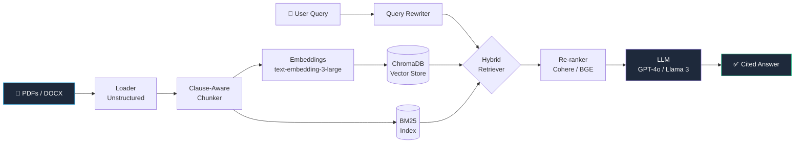

# Lexi-Rag
Legal Document Intelligence — RAG over contracts with cited answers
<div align="center">

# 🏛️ Lexi

### Legal Document Intelligence — Powered by Retrieval-Augmented Generation

*Ask questions across thousands of contracts. Get cited, grounded answers in seconds.*

[](https://python.org)
[](https://fastapi.tiangolo.com)
[](https://nextjs.org)
[](https://langchain.com)
[](LICENSE)

[Features](#-features) • [Architecture](#-architecture) • [Quickstart](#-quickstart) • [Configuration](#-configuration) • [Roadmap](#-roadmap)

</div>

---

## ✨ Why Lexi?

Legal teams drown in contracts. Keyword search misses nuance. Generic LLMs hallucinate clauses that don't exist.

**Lexi** is a domain-tuned RAG system that reads your contracts, understands legal structure, and answers questions with **precise citations** — every claim traced back to a paragraph in a source document.

> **"What's our liability cap in the Acme MSA?"**
> → *"The liability cap is set at 12 months of fees paid (Section 8.2, Acme_MSA_2024.pdf, p.14)."*

---

## 🎯 Features

| | Feature | Description |
|---|---|---|
| 🔍 | **Hybrid Retrieval** | Dense (embedding) + sparse (BM25) fusion for recall on legal jargon |
| 📎 | **Grounded Citations** | Every answer links to source chunks with page + clause references |
| 🧠 | **Domain-Aware Chunking** | Splits on clause boundaries, not arbitrary token counts |
| 🎨 | **Premium UI** | Streaming responses, source cards, keyboard-first design |
| 📊 | **Eval Dashboard** | RAGAS metrics: faithfulness, answer relevance, context precision |
| 🔐 | **Local-First** | Runs fully offline with Ollama; swap to OpenAI with one env var |
| 🐳 | **One-Command Deploy** | `make up` → full stack running in Docker |

---

## 🏗️ Architecture



**Pipeline stages:**

1. **Ingest** — PDFs parsed with `unstructured`, preserving section headers
2. **Chunk** — Legal-aware splitter respects `Article`, `Section`, `Clause` boundaries
3. **Index** — Dual index: Chroma (dense) + BM25 (sparse)
4. **Retrieve** — Reciprocal Rank Fusion over both indexes
5. **Re-rank** — Cross-encoder re-ranker narrows to top-5
6. **Generate** — LLM produces answer with structured citations
7. **Verify** — Faithfulness check flags unsupported claims

---

## 🚀 Quickstart

### Prerequisites

- Docker + Docker Compose
- An OpenAI API key *(or run fully local with Ollama)*

### 1. Clone & configure

```bash
git clone https://github.com/DarkWaterReflection949/Lexi-Rag.git
cd Lexi-Rag
cp .env.example .env
# Edit .env and add your OPENAI_API_KEY
```

### 2. Launch the stack

```bash
make up
```

| Service | URL |
|---|---|
| 🎨 Frontend | http://localhost:3000 |
| ⚡ API | http://localhost:8000 |
| 📚 API Docs | http://localhost:8000/docs |

### 3. Ingest your contracts

Drop PDFs into `data/` and run:

```bash
make ingest
```

### 4. Ask away 🎉

Open http://localhost:3000 and start querying.

---

## 🛠️ Tech Stack

<table>
<tr>
<td valign="top" width="50%">

**Backend**
- ⚡ FastAPI + Uvicorn
- 🦜 LangChain 0.2
- 🔢 ChromaDB (vectors)
- 🏎 rank-bm25 (sparse)
- 📄 unstructured (parsing)
- 🧪 RAGAS (evaluation)

</td>
<td valign="top" width="50%">

**Frontend**
- ▲ Next.js 14 (App Router)
- 🎨 Tailwind CSS + shadcn/ui
- 🎞️ Framer Motion
- 📡 Server-Sent Events (streaming)
- 🌗 Dark mode by default

</td>
</tr>
</table>

---

## 📁 Project Layout

```
Lexi-Rag/
├── backend/          # FastAPI + RAG pipeline
│   └── app/
│       ├── api/      # HTTP routes
│       ├── core/     # RAG, embeddings, vectorstore
│       └── models/   # Pydantic schemas
├── frontend/         # Next.js 14 UI
│   └── src/
│       ├── app/      # Pages & layout
│       ├── components/
│       └── lib/
├── data/             # Your PDFs go here
├── docs/             # Architecture & screenshots
└── docker-compose.yml
```

---

## ⚙️ Configuration

All settings via `.env`:

| Variable | Default | Description |
|---|---|---|
| `OPENAI_API_KEY` | — | Required if using OpenAI |
| `LLM_PROVIDER` | `openai` | `openai` \| `ollama` \| `anthropic` |
| `LLM_MODEL` | `gpt-4o-mini` | Any supported model |
| `EMBEDDING_MODEL` | `text-embedding-3-large` | |
| `CHUNK_SIZE` | `800` | Tokens per chunk |
| `CHUNK_OVERLAP` | `120` | Overlap between chunks |
| `TOP_K` | `5` | Chunks passed to LLM |
| `RERANK_ENABLED` | `true` | Enable cross
